# Clinic Copilot BD

## Health Worker Assistant For Bangladesh Frontline Care

### AI decision support for small hospitals, overloaded clinics, field health workers, and low-resource primary care teams

Prepared for the **Health Worker Assistant** hackathon segment:

> An AI decision-support tool for field health workers to improve frontline healthcare delivery.

**Report audience:** investors, hospital owners, clinic operators, hackathon judges, healthcare researchers, NGO/public-health partners, and product marketing teams.

**Report status:** live prototype evidence, refreshed screenshots, MCP-ready architecture, synthetic-data demo, production hardening plan.

**Date:** June 12, 2026

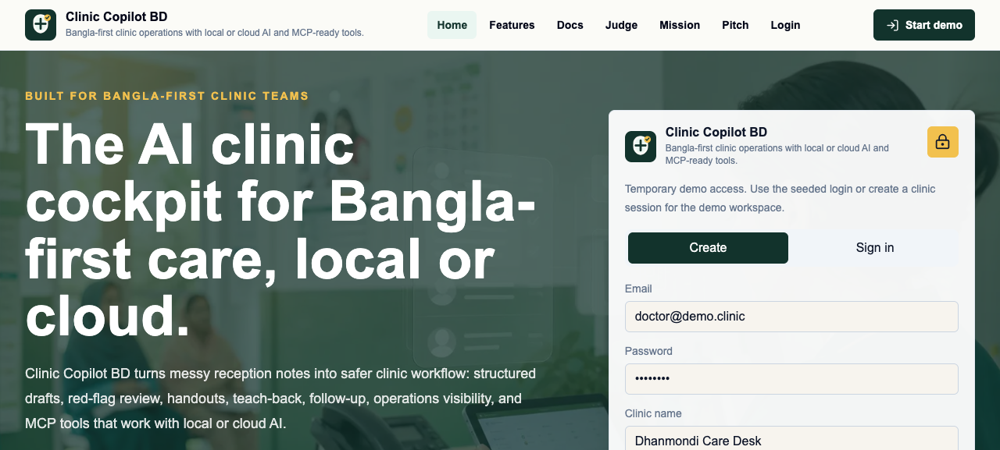

---

## Cover Summary

**Clinic Copilot BD** is a Bangla-first AI assistant for smaller hospitals, private clinics, community clinics, and frontline health workers who operate under real field constraints: too few staff, crowded queues, mixed Bangla-English intake, incomplete vitals, limited physician time, low-connectivity environments, and high patient follow-up burden.

The product helps a health worker move from **messy patient story** to **safe next action**:

1. Capture intake in Bangla, English, or mixed language.
2. Convert it into structured draft support.
3. Surface missing vitals, allergy gaps, pregnancy/child/chest-pain red flags, and return-warning blockers.
4. Produce clinician-reviewable handoff, print packet, patient education, and follow-up tasks.
5. Keep an audit trail and require human review for clinical or patient-facing outputs.
6. Expose the same workflow through MCP so external agents and local AI hosts can use the tool safely.

**Positioning:** not a doctor replacement, not a diagnosis bot, not a generic chatbot. It is a practical hospital and health worker assistant for safer frontline delivery when staff are overloaded.

---

## Who This Report Is For

| Audience | What They Should See |
|---|---|
| Investors | Large Bangladesh need, clear buyer wedge, scalable workflow product, local/cloud AI flexibility, MCP platform upside, and credible safety boundaries. |
| Smaller hospitals and clinics | Immediate workload relief for intake, triage, documentation, handoff, patient education, follow-up, and approvals without needing a full hospital information system. |
| Larger hospitals | Throughput support for outpatient departments, emergency triage desks, training, audit, queue operations, discharge education, and department-level quality review. |
| Hackathon judges | Direct fit to the Health Worker Assistant segment: decision support, field usability, low-resource constraints, offline/local model path, safety, and public health relevance. |
| Researchers | Structured workflows, auditable AI outputs, scenario scorecards, synthetic cases, safety envelopes, and an MCP interface for reproducible evaluation. |
| Marketing and partnerships | A concise Bangladesh story: overloaded facilities, practical AI, Bangla-first patient communication, and a product that helps staff instead of replacing them. |

---

## Visual Product Evidence

These screenshots were captured from the running application after a production build and QA flow. They show the public narrative, authenticated health worker workspace, AI surfaces, operations views, and MCP Explorer.

### Public Site And Demo Entry


**Public home:** frames the product as a practical health worker assistant with local/cloud model choice and MCP support.

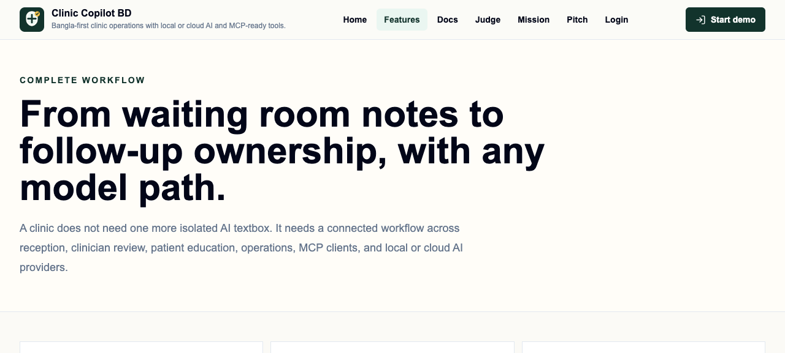

**Feature page:** shows the product modules, safety-oriented AI surfaces, and agentic workflow story.

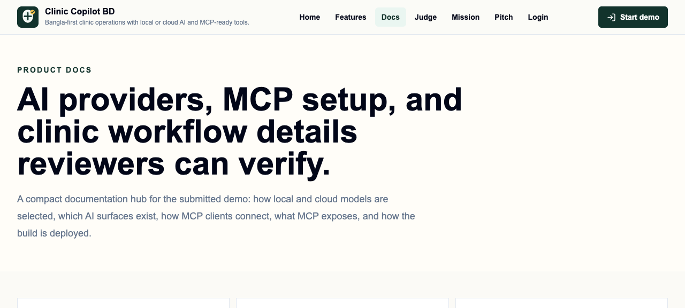

**Docs page:** gives judges, partners, and technical reviewers a verifiable path through AI providers, MCP, and demo workflows.

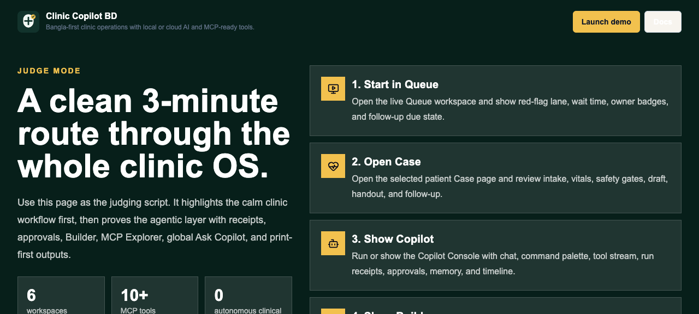

**Judge mode:** short evaluation route for hackathon reviewers.

### Health Worker And Clinic Workspace

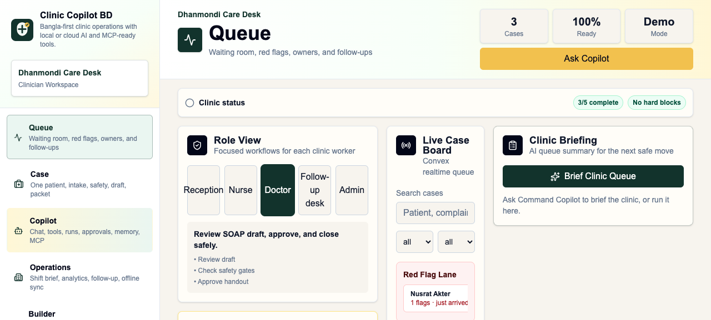

**Queue workspace:** prioritizes waiting patients, red-flag lane, owners, and follow-up pressure for overloaded front desks.

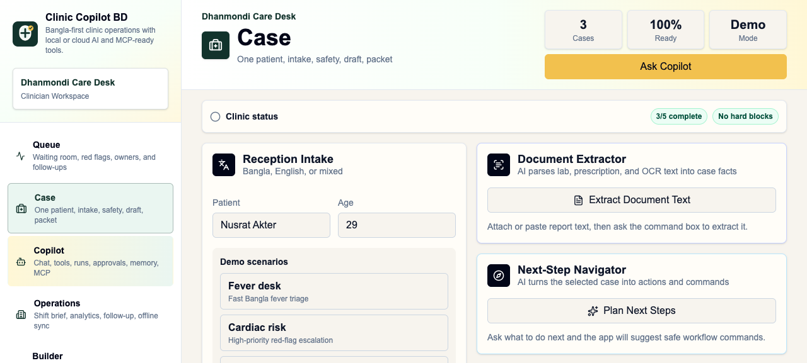

**Case workspace:** intake cleanup, clinical safety gates, draft support, patient handout, medicine safety, and approval guard in one place.

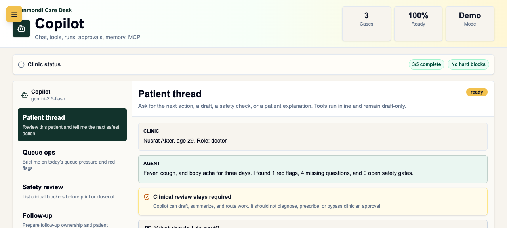

**Copilot workspace:** patient-thread support with explicit clinical review boundaries.

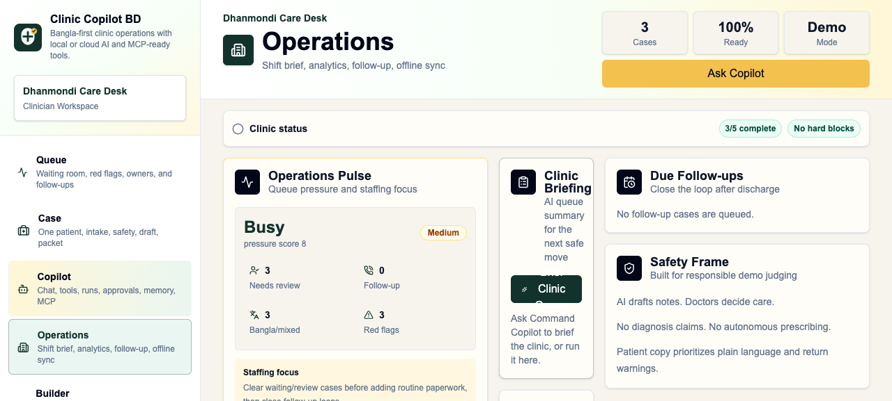

**Operations workspace:** queue pressure, follow-up ownership, and shift-level visibility for supervisors.

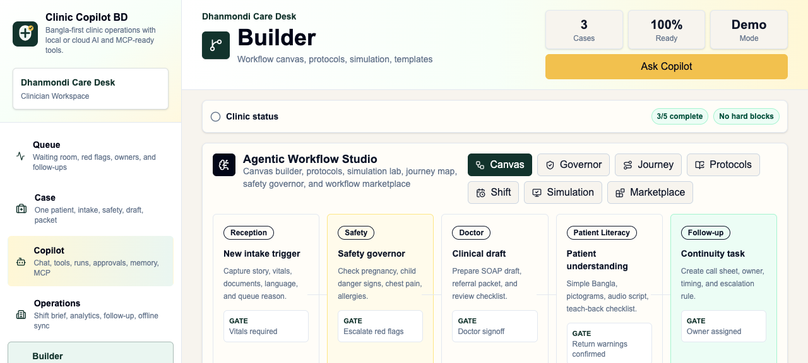

**Builder workspace:** agentic workflow studio for adding and showing bounded tools.

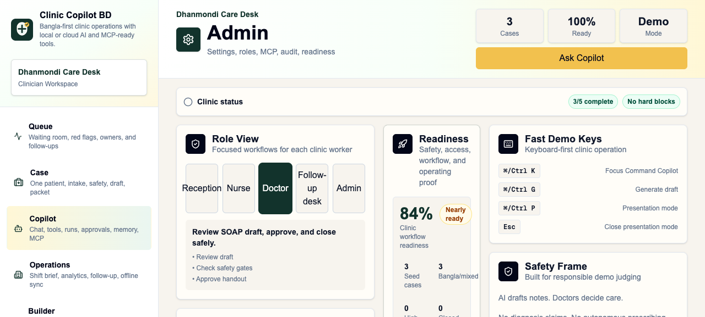

**Admin workspace:** readiness, audit, and MCP surfaces for program managers and technical reviewers.

### AI, Safety, And MCP Proof

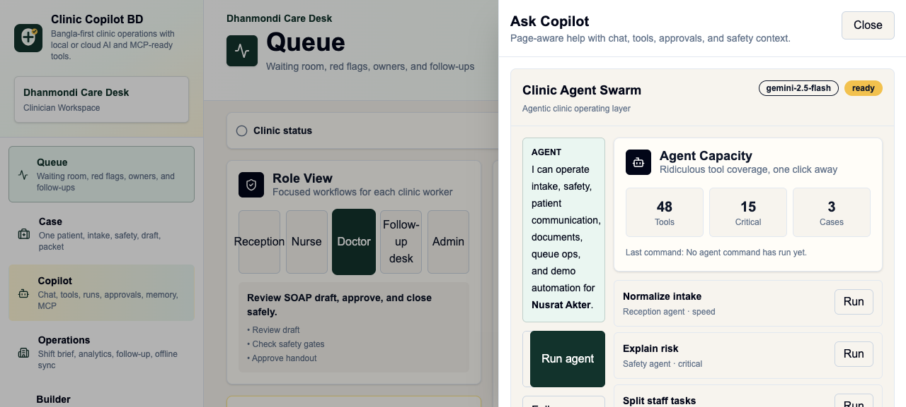

**Ask Copilot drawer:** global assistant, AI run receipts, and approvals inbox.


**MCP Explorer:** proves external agents can inspect and call workflow tools through the app's MCP-compatible layer.

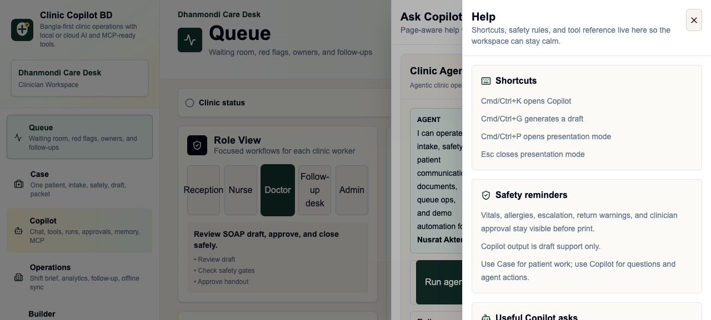

**Help drawer:** makes the demo navigable for users, judges, and operators without training.

---

## Why This Matters In Bangladesh

Bangladesh is exactly the type of setting where frontline decision support can matter:

| Signal | Data Point | Why It Matters |
|---|---:|---|
| Large population | 173.6 million people in 2024 | Small workflow improvements can affect millions of patient encounters. |
| Low physician density | 0.722 physicians per 1,000 people in 2023 | Frontline workers carry a large share of first-contact care and triage. |
| High out-of-pocket burden | 79.3% of current health expenditure paid out of pocket in 2023 | Avoidable revisits, confusion, and missed warning signs are expensive for families. |
| Community clinic model | Each local community clinic has one full-time community health care provider assisted by two community health workers | The product maps naturally to the actual team structure. |
| CHW scale precedent | BRAC's Shasthya Shebika/Kormi programs show tens of thousands of community health workers can be organized and supported | A practical assistant can scale through existing frontline models. |
| Private facility footprint | A 2021 Data for Impact brief cites 9,529 private diagnostic centers registered with DGHS in 2020 and notes reports suggesting private hospitals, clinics, and diagnostic centers may be around 11,940 | Small private facilities are a large, fragmented market where lightweight workflow software can spread faster than heavy hospital systems. |
| Workforce strain | Bangladesh workforce studies repeatedly describe shortage, skill-mix gaps, poor working conditions, and excessive frontline workload | The product targets the daily work compression that smaller hospitals and clinics feel most sharply. |
| Digital strategy alignment | Bangladesh Digital Health Strategy 2023-2027 emphasizes mobile health, AI, digital literacy, interoperability, privacy, and service delivery innovation | The project fits national direction, not just hackathon novelty. |

Sources are listed at the end of this document.

---

## The Frontline Problem

Field health workers and community clinic staff often have to make fast operational decisions with incomplete information:

- Is this patient safe to wait, or should they be escalated?
- Are vitals missing?
- Did anyone check medicine allergies?
- Is this a pregnancy, child, chest-pain, diabetes, fever, dehydration, or danger-sign case?
- What should be asked next?
- What should the nurse or doctor review?
- What should the patient or family understand before leaving?
- Who owns follow-up?
- What gets printed, and what requires approval?

Most AI demos answer a question. Field health workers need something more practical: a workflow assistant that says **what is missing, what is risky, what to do next, and what needs human review**.

---

## Primary Market: Smaller Hospitals And Overloaded Clinics

The strongest early wedge is not a top-tier tertiary hospital with mature IT teams. It is the smaller hospital, local private clinic, diagnostic-linked clinic, NGO clinic, community clinic, or outpatient desk where demand is high and staffing is thin.

### Why smaller facilities feel the pain first

- One doctor may cover too many patients.
- Nurses often handle intake, triage, patient explanation, and coordination at the same time.
- Reception staff may capture symptoms without a clinical checklist.
- Paper notes, WhatsApp follow-up, printed slips, and verbal handoff are fragmented.
- Patients may return because instructions were unclear.
- High-risk cases can wait in the same queue as routine cases.
- Staff turnover makes consistent protocols hard to maintain.

### How Clinic Copilot BD helps smaller hospitals

| Operational Pain | Product Response |
|---|---|
| Too many patients for the available doctor | Queue risk summary, red-flag lane, missing-vitals checks, concise doctor handoff. |
| Reception captures incomplete information | Bangla/English intake cleanup, missing question finder, safety gate prompts. |
| Nurses are overloaded | Staff task list, vitals/allergy blockers, approval readiness, visit closeout checklist. |
| Patient education takes time | Simple Bangla handout, teach-back checklist, audio script, pictogram plan. |
| Follow-up is inconsistent | Follow-up due panel, call sheet, reply triage, owner badges. |
| Documentation slows the visit | Draft SOAP support, referral packet, print workflow, AI run receipt. |
| Clinic owner needs quality visibility | Audit log, operations pulse, trends, MCP resource access. |

### Why this is a realistic buyer wedge

Small hospitals and clinics need software that improves today's work without forcing a full digital transformation. Clinic Copilot BD can start as a lightweight assistant beside existing paper or basic systems, then expand into queue, audit, follow-up, and integration workflows.

---

## Larger Hospital Benefit

Large hospitals may have more staff and stronger systems, but they still face bottlenecks in OPD, emergency intake, nursing handoff, patient education, and department-level quality review.

| Larger Hospital Area | Benefit |
|---|---|
| Outpatient department | Faster intake normalization, risk sorting, and doctor-ready summaries. |
| Emergency or urgent desk | Conservative red-flag prompts and escalation blockers before patients wait too long. |
| Nursing stations | Shared task list, handoff, visit closeout, and approval readiness. |
| Discharge and patient education | Simple Bangla instructions, teach-back, return warnings, and follow-up ownership. |
| Training | Synthetic scenarios, scorecards, role-based practice, and reviewable AI run receipts. |
| Quality and compliance | Audit trail, safety envelope, approval logs, and MCP-readable workflow outputs. |
| Research and evaluation | Structured case scenarios, measurable outputs, and reproducible MCP tool calls. |

The same product can therefore sell down-market as immediate workload relief and up-market as throughput, safety, training, and quality infrastructure.

---

## Product Thesis

The best AI health worker assistant in Bangladesh will not be the most medically ambitious model. It will be the one that is:

- fast enough for a crowded clinic,
- safe enough for real frontline use,
- Bangla-first,
- useful without perfect internet,
- clear about what it cannot decide,
- able to hand work from reception to nurse to doctor to follow-up staff,
- easy to demo, audit, and integrate.

Clinic Copilot BD is built around that thesis.

---

## Health Worker Assistant Fit

The hackathon asks for a practical AI assistant for field health workers in real-world conditions. Clinic Copilot BD addresses each scoring axis directly.

| Challenge Requirement | How Clinic Copilot BD Responds |
|---|---|
| Decision support | Missing question finder, red-flag detection, vitals/allergy blockers, medicine clarity, approval readiness, risk explanation, next-step navigator. |
| Field conditions | Mobile-friendly UI, printable outputs, low-connectivity sync review queue, deterministic fallback when no AI provider is available. |
| Public health delivery | Queue snapshots, follow-up ownership, patient education, teach-back, handoff, referral/visit summaries. |
| Low-resource usability | Bangla/English intake, large text, high contrast, calm motion, role-based workspaces, one-click demo scenarios. |
| Frontline professional support | Supports reception, nurse, doctor, follow-up desk, admin, and auditor viewpoints. |
| Safety | Human review envelope, no diagnosis/prescription authority, escalation triggers, audit receipts, approval inbox. |
| Practical impact | Reduces documentation burden, catches missing checks, improves handoff and patient understanding, makes follow-up visible. |

---

## Core User Personas

### 1. Community Health Worker

Needs fast guidance while visiting households or supporting a community clinic.

What the assistant does:

- Turns a rough symptom story into structured notes.
- Flags danger signs and missing vitals.
- Produces simple Bangla education and teach-back questions.
- Prepares referral or follow-up notes for review.

### 2. Community Health Care Provider

Works inside a community clinic with limited time and high patient flow.

What the assistant does:

- Summarizes the queue.
- Prioritizes red-flag cases.
- Generates handoff tasks for doctor/nurse review.
- Keeps patient-facing output in draft state until reviewed.

### 3. Nurse Or Field Supervisor

Supervises safety checks and task completion.

What the assistant does:

- Checks vitals, allergy status, return warnings, and escalation triggers.
- Builds task lists.
- Prepares print packets.
- Tracks approvals.

### 4. Doctor Or Remote Clinician

Needs concise review material, not raw intake noise.

What the assistant does:

- Provides SOAP-style draft support.
- Shows evidence for and against risk.
- Lists missing questions.
- Produces referral/visit summaries and closeout packets.

### 5. Program Manager / NGO / Public Health Admin

Needs visibility across service delivery.

What the assistant does:

- Queue pressure.
- Trend dashboard.
- Audit logs.
- MCP resource access.
- Synthetic scenario scoring for training and evaluation.

---

## The Workflow

### Field-to-clinic loop

```txt
Patient story
  -> Intake cleanup
  -> Safety blocker check
  -> Missing question list
  -> Draft clinical support
  -> Nurse/doctor handoff
  -> Patient handout / teach-back
  -> Follow-up owner
  -> Audit receipt
  -> Program visibility
```

### What makes it practical

- Every action maps to a real health worker task.
- Every clinical/patient-facing output is draft support.
- Every risky output can require human review.
- Every MCP tool returns a safety envelope.
- Every route works without an API key through deterministic fallback.
- Every local-model route can recover from timeout or invalid JSON.

### Workflow Diagram

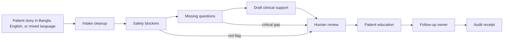

### Multi-Role Hospital Flow

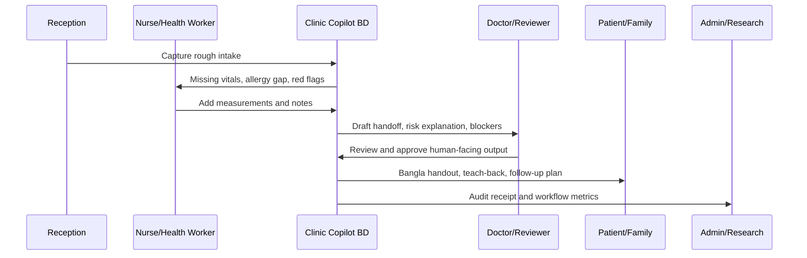

---

## Coolest Features

### 1. Safety Blocker Engine

Checks for:

- missing vitals,
- allergy gap,
- unconfirmed return warnings,
- pregnancy signals,
- child danger-sign risk,
- chest pain/cardiac-risk language,
- severe symptoms.

Why it matters: this is the difference between a generic AI answer and real field triage support.

### 2. Bangla-First Intake To Draft

The app handles Bangla, English, and mixed intake. It can convert rough field notes into:

- chief complaint,
- timeline,
- severity,
- missing questions,
- red flags,
- SOAP support,
- doctor checklist,
- patient handout,
- follow-up.

### 3. Patient Education And Teach-Back

The assistant prepares:

- simple Bangla explanations,
- printable handouts,
- pictogram plan,
- audio script,
- teach-back checklist.

Why it matters: patient understanding is a health outcome, not a UI extra.

### 4. Agent Command Center

Named agent tools map directly to health worker tasks:

- detect missing vitals,
- detect allergy gap,
- audit case safety,
- generate staff tasks,
- prepare referral packet,
- rewrite for low literacy,
- translate Bangla/English,
- recommend next agent action.

### 5. AI Run Receipts

Each AI/action run can show:

- input,
- output type,
- role,
- timestamp,
- safety state,
- human-review boundary.

Why it matters: investors and health systems will ask how AI decisions are traced.

### 6. Approvals Inbox

Tracks human approval needs:

- vitals review,
- allergy confirmation,
- red-flag acknowledgment,
- print packet approval,
- escalation acknowledgment.

### 7. Local Or Cloud AI

The same app can run with:

- **LM Studio locally** through an OpenAI-compatible AI SDK provider,
- **Google Gemini in the cloud**,
- **fallback demo output** when no model is available.

Why it matters: frontline deployments cannot assume stable internet, cloud budget, or a single model vendor.

### 8. MCP Server For External Agents

The project exposes a real stdio MCP server plus an HTTP JSON-RPC demo endpoint.

MCP lets external tools and assistants discover and call:

- clinic tool registry,
- safety blockers,
- queue snapshot,
- print packet preparation,
- literacy support,
- sync review,
- approval envelope,
- scenario scorecard.

Why it matters: the product is not a closed app; it is an agent-ready health workflow layer.

---

## Full Feature Inventory

### AI Workflow

- Local LM Studio provider.
- Cloud Google Gemini provider.
- No-key deterministic fallback.
- Mixed Bangla/English intake cleanup.
- Clinical draft generation.
- SOAP-style support.
- Missing question finder.
- Current-case AI Q&A.
- Command Copilot.
- Named agent command aliases.
- Draft edit support.
- Document extraction from lab, prescription, or OCR text.
- Clinic briefing.
- Next-step navigator.

### Safety

- Red-flag summary.
- Vitals requirement checks.
- Allergy gap checks.
- Medicine clarity checker.
- Pregnancy/child/chest-pain escalation patterns.
- Approval readiness guard.
- Visit closeout checklist.
- Risk explanation.
- Human-review boundary.
- AI Run Receipts.
- Approvals Inbox.
- Audit log viewer.

### Health Worker Operations

- Queue board.
- Waiting-time labels.
- Red-flag lane.
- Staff owner badges.
- Follow-up due panel.
- Operations Pulse.
- Shift Copilot.
- Staff handoff.
- Clinic trend dashboard.
- Low-connectivity review queue.
- Role-aware workspaces.

### Patient Communication

- Bangla/English handout.
- Printable handout.
- Medicine slip.
- Referral packet.
- Doctor summary.
- Follow-up call sheet.
- Simple Bangla mode.
- Pictogram support.
- Audio script support.
- Teach-back checklist.
- Patient question answer assistant.
- Reply triage.
- Follow-up composer and scheduler.

### Agentic And MCP Layer

- Stdio MCP server.
- HTTP JSON-RPC demo endpoint.
- MCP tools/list and resources/read.
- `mcp.json` for LM Studio and local MCP hosts.
- MCP Explorer in Admin.
- Tool registry resource.
- Safety gate resource.
- Demo scenario resource.
- Capability map resource.
- Scenario scorecard.

### UX And Accessibility

- Mobile-first clinic workspace.
- Desktop sidebar.
- Mobile bottom navigation.
- Large text mode.
- High contrast mode.
- Calm motion mode.
- Presentation mode.
- Guided 3-minute demo route.
- Help drawer.
- Global Ask Copilot launcher.
- Public docs and judge route.

---

## Multi-View Workflow

Clinic Copilot BD is designed around the reality that one patient journey involves multiple workers.

| Viewpoint | Main Need | Product Surface |
|---|---|---|
| Reception | Capture story quickly | Intake, queue, command copilot |
| Community health worker | Ask what matters next | Safety blockers, missing questions, patient education |
| Nurse | Confirm safety gates | Vitals/allergy/return-warning checks, handoff |
| Doctor | Review concise support | SOAP support, risk explanation, approval readiness |
| Follow-up desk | Close the loop | Scheduler, reply triage, due panel |
| Admin/program manager | See service delivery | Trends, audit logs, queue pressure, MCP resources |
| External agent | Integrate safely | MCP stdio server and HTTP demo endpoint |

---

## AI Safety Architecture

### What the AI is allowed to do

- Summarize intake.
- Suggest missing questions.
- Draft handoff notes.
- Draft patient education.
- Flag safety blockers.
- Prepare review packets.
- Explain risk uncertainty.
- Suggest operational next steps.

### What the AI is not allowed to do

- Diagnose.
- Prescribe.
- Approve final care.
- Dismiss urgent symptoms.
- Finalize patient-facing instructions without human review.
- Replace clinicians.

### Safety controls

- Zod output schemas.
- Provider failure fallback.
- No-key fallback.
- Human-review flags.
- Safety envelopes in MCP outputs.
- Audit receipts.
- Approval inbox.
- Explicit prompt boundaries.
- Route contract tests that block placeholder AI routes.
- Browser QA that exercises actual AI UI actions.

### Safety Control Diagram

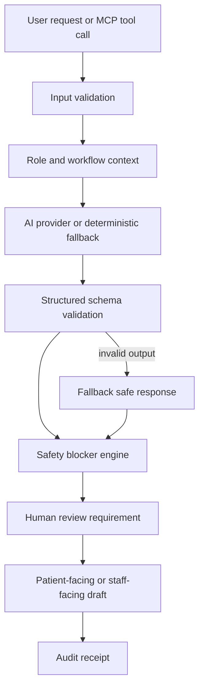

---

## Security Model

Clinic Copilot BD is currently a hackathon prototype using synthetic data and temporary demo authentication. The production security model is straightforward: protect patient data, constrain model access, preserve human accountability, and make every AI/tool action auditable.

### Current prototype security boundaries

- Synthetic demo data only.
- Temporary demo login for testing.
- AI outputs are draft support, not final clinical authority.
- MCP tools return safety envelopes.
- API routes validate inputs and fall back on safe deterministic responses.
- No production PHI storage claim is made in the demo.

### Production security plan

| Layer | Production Control |
|---|---|
| Identity | Real organization accounts, SSO/OIDC where available, role-based access for reception, nurse, clinician, admin, auditor, and researcher. |
| Authorization | Server-side role checks for every case, tool call, approval, export, and patient-facing output. No client-trusted user IDs. |
| Patient data | Encryption in transit, encryption at rest, tenant isolation, minimal retention, patient consent flow, and configurable data residency. |
| Local AI | LM Studio or local OpenAI-compatible models run inside the clinic/hospital network for privacy-sensitive deployments. |
| Cloud AI | Cloud provider calls use redaction, minimum necessary context, provider allowlist, timeout, schema validation, and audit logging. |
| MCP | Tool allowlist, server-side validation, role-scoped outputs, safety envelopes, and no MCP bypass of clinic permissions. |
| Audit | Immutable event trail for intake changes, AI calls, approvals, print packets, exports, and MCP calls. |
| Human review | Patient-facing instructions, clinical handoffs, referrals, and signoff packets remain drafts until a responsible staff member approves. |
| Research mode | De-identified exports, synthetic scenarios, scenario scorecards, and reproducible tool calls before any real-world study. |
| Operations | Rate limits, monitoring, error reporting, backup/restore, incident response, and admin controls for disabling model providers or tools. |

### Security Architecture Diagram

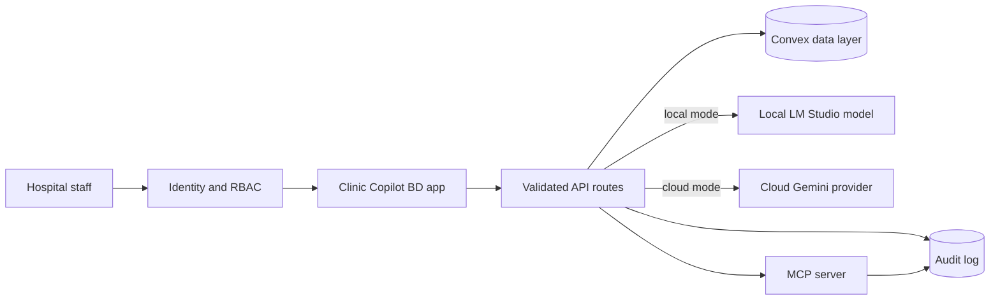

### Research and regulatory posture

Clinic Copilot BD should enter real deployments through a staged governance path:

1. Synthetic case testing.
2. Health worker usability testing with no real patient data.
3. De-identified retrospective workflow study.
4. Supervised pilot with consent, clinician oversight, and audit review.
5. Production deployment only after privacy, security, clinical governance, and local regulatory requirements are satisfied.

---

## MCP: Why It Is Strategic

MCP turns Clinic Copilot BD from an app into an agent-ready health worker platform.

### What MCP enables

- LM Studio can call clinic tools from local models.
- Claude/Codex/Cursor-style clients can spawn the stdio MCP server.
- Public demos can call `/api/mcp` over JSON-RPC.
- External agents can inspect tool schemas before acting.
- Safety rules travel with tool outputs.

### MCP tools

```txt
clinic.demo_manifest
clinic.list_demo_scenarios
clinic.workflow_brief
clinic.tools.list
clinic.tools.describe
clinic.queue.snapshot
clinic.safety.get_blockers
clinic.print.prepare_packet
clinic.literacy.prepare
clinic.sync.preview_queue
clinic.approval.request
clinic.demo.score_scenario
```

### MCP resources

```txt
clinic://demo/scenarios
clinic://demo/capabilities
clinic://agents/tool-registry
clinic://safety/gates
```

### Demo command

```bash
bun run mcp:smoke
```

This proves the stdio server starts, lists 12 tools, calls safety blockers, and lists resources.

---

## Model Strategy: Local And Cloud

### Why local models matter

Field settings may have:

- unstable internet,
- privacy concerns,
- low budget,
- latency constraints,
- limited cloud availability,
- model vendor uncertainty.

Clinic Copilot BD supports LM Studio locally through the AI SDK OpenAI-compatible provider.

### Why cloud models matter

Cloud models can provide:

- stronger structured output,
- better multilingual reasoning,
- easier scaling during pilots,
- centralized model updates.

Clinic Copilot BD supports Google Gemini through `@ai-sdk/google`.

### Why fallback matters

For demonstrations, training, and offline-style use, the app can return safe deterministic output when no provider is configured. This makes the product testable without fragile API dependencies.

### Deployment Pattern

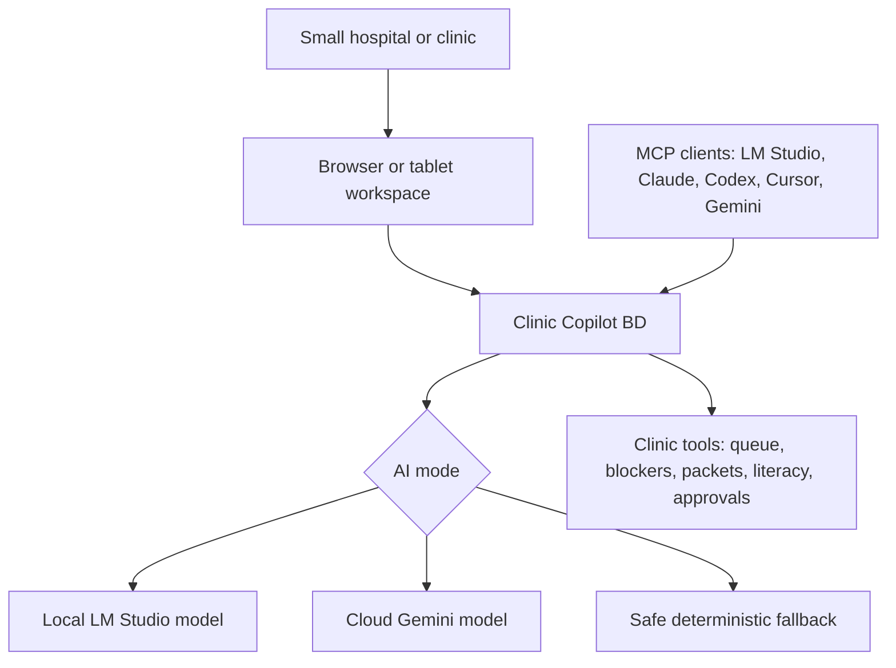

---

## Stack

| Layer | Technology |
|---|---|
| Frontend | Next.js 16 App Router, React 19, TypeScript |
| Styling | Tailwind CSS 4, responsive mobile-first UI |
| Backend | Convex realtime data, Next.js API routes |
| AI SDK | Vercel AI SDK 6 |
| Cloud AI | `@ai-sdk/google` |
| Local AI | `@ai-sdk/openai-compatible` for LM Studio |
| MCP | `@modelcontextprotocol/sdk`, stdio server, JSON-RPC HTTP demo route |
| Validation | Zod schemas |
| QA | Bun tests, Biome, Next build, browser QA, MCP smoke |
| Package/runtime | Bun |

---

## Scalability And Modularity

### Modular by role

The system separates views for queue, case review, copilot, operations, builder, and admin.

### Modular by AI provider

Provider selection is centralized. Routes do not hard-code one model provider.

### Modular by tool

Each MCP tool maps to one bounded workflow capability. This makes it easier to add or remove tools without rewriting the app.

### Modular by safety layer

Safety checks, approval requirements, audit receipts, and fallback logic are not hidden inside one prompt. They are product surfaces.

### Scalable rollout path

1. Demo mode with synthetic cases.
2. Small hospital or clinic pilot with no real patient storage.
3. Community clinic or NGO pilot with supervised health workers.
4. Local LM Studio deployment for privacy-sensitive training.
5. Cloud provider deployment for stronger model quality.
6. Convex-backed realtime case workflow.
7. MCP integration with health system tools and NGO dashboards.

---

## Why Investors Should Care

### 1. The user pain is operational, frequent, and expensive

Every clinic day creates repeated tasks: intake, triage, documentation, patient explanation, follow-up, and handoff. A product that improves each encounter can compound quickly.

### 2. Bangladesh is a high-leverage proving ground

Large population, low physician density, strong community health worker history, high household spending burden, and national digital health priorities create a strong reason to test frontline AI here.

### 3. The product avoids the riskiest AI-health trap

It does not sell autonomous diagnosis. It sells decision support, documentation acceleration, safety checks, and human-reviewed patient communication.

### 4. The architecture is model-flexible

Local and cloud AI support reduces vendor lock-in and makes the product more realistic for low-resource deployment.

### 5. MCP makes it platform-shaped

The app can become a tool layer for other agents, not just a standalone UI.

### 6. The demo is already product-shaped

It includes public site, docs, auth, role workspaces, safety gates, MCP, tests, browser QA, local model support, cloud model support, and fallback behavior.

---

## Business And Deployment Opportunities

### Beachhead market

The first practical market is smaller hospitals and high-volume clinics that cannot wait for a large hospital information system rollout. These facilities need immediate help with intake, queue pressure, staff handoff, patient explanation, and follow-up.

### Expansion market

After proving workflow value in smaller facilities, the same product can expand into:

- OPD departments inside larger hospitals.
- Emergency intake and triage support.
- Nursing quality and handoff programs.
- Discharge education and follow-up teams.
- Training programs for junior staff and community health workers.
- Research pilots that need reproducible, auditable AI workflow outputs.

### Potential customers

- Small private hospitals.
- Local clinics with diagnostic or pharmacy workflow.
- High-volume outpatient departments.
- NGO health programs.
- Community clinic networks.
- Public health pilots.
- Rural health service providers.
- Digital health implementers.
- Training programs for community health workers.
- Maternal/child health and NCD screening programs.

### Potential pricing paths

- Per-clinic monthly subscription.
- Per-small-hospital monthly subscription by department or seat count.
- Per-health-worker mobile seat.
- NGO/program deployment license.
- White-label public health workflow assistant.
- MCP/API access tier for health-tech integrations.

### Investor wedge

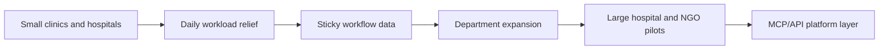

### Expansion modules

- Maternal health module.
- Child danger-sign module.
- NCD screening module.
- TB follow-up module.
- Immunization reminder module.
- Offline-first Android field app.
- Supervisor dashboard.
- Ministry/NGO reporting export.

---

## Demo Script For The Health Worker Assistant Segment

### 0:00 - The field problem

"A health worker hears a mixed Bangla-English symptom story. The question is not just what the patient has. The question is: what is missing, what is risky, what should be escalated, and what should the family understand?"

### 0:30 - Intake to structured support

Load a demo case and generate the draft. Show missing questions, red flags, and SOAP support.

### 1:10 - Safety blockers

Run medicine safety or approval readiness. Show missing vitals, allergy checks, and red-flag review.

### 1:50 - Patient communication

Open handout, simple Bangla, teach-back, pictogram, or audio script support.

### 2:30 - Follow-up ownership

Move the case to follow-up, show due panel, reply triage, and staff handoff.

### 3:00 - MCP and model flexibility

Run `bun run mcp:smoke`. Explain that the same workflow can be called from LM Studio, Claude, Codex, Cursor, or another MCP host, and can run with local or cloud models.

---

## Current Proof

- `bun run validate` passes.
- `bun run qa:browser` passes.
- `bun run mcp:smoke` passes.
- LM Studio local model endpoint tested.
- Gated LM Studio route tests added.
- No-key fallback route tests added.
- Contract tests ensure AI routes keep fallback and error handling.
- Browser QA covers public pages, authenticated workspace, interactive AI workflow, Ask Copilot, help drawer, and MCP Explorer.

---

## Risks And Honest Limitations

| Risk | Current Mitigation |
|---|---|
| Local models sometimes return invalid structured JSON | Timeout, no-retry setting, provider failure fallback, schema tests. |
| AI could be mistaken for medical authority | Product copy, prompts, safety envelopes, human-review flags, approval inbox. |
| Connectivity may be weak | Demo fallback and low-connectivity review queue pattern. |
| Real deployment needs privacy/security hardening | Current demo uses synthetic data and temporary auth only. |
| Field UX must be tested with real CHWs | Current app is a strong prototype; next step is supervised usability testing. |

---

## Next Milestones

1. Add explicit provider status in the UI: local live, cloud live, fallback, timeout.
2. Build offline-first Android wrapper or PWA field mode.
3. Add maternal/child/NCD-specific field protocols.
4. Add supervisor dashboard for CHW programs.
5. Add exportable program reports.
6. Add privacy hardening and production authentication.
7. Pilot with synthetic or anonymized workflows before any real patient use.

---

## Source Notes

- World Bank Open Data, Bangladesh population: 173,562,364 in 2024.  
  https://data.worldbank.org/indicator/SP.POP.TOTL?locations=BD
- World Bank Open Data, physicians per 1,000 people: 0.722 in 2023.  
  https://data.worldbank.org/indicator/SH.MED.PHYS.ZS?locations=BD
- World Bank Open Data, out-of-pocket expenditure share of current health expenditure: 79.30711365% in 2023.  
  https://data.worldbank.org/indicator/SH.XPD.OOPC.CH.ZS?locations=BD
- WHO feature story on Bangladesh community health workers and community clinics: one full-time community health care provider assisted by two community health workers; CHWs provide antenatal/postnatal care, diabetes and blood pressure checks, fever/diarrhoea/cough screening, family planning, nutrition, adolescent health, hygiene, and more.  
  https://www.who.int/news-room/feature-stories/detail/bangladesh-community-health-workers-at-the-heart-of-a-stronger-health-system-and-the-fight-against-covid-19
- CHW Central profile of BRAC Shasthya Shebika and Shasthya Kormi programs: approximately 43,000 Shasthya Shebikas and 4,300 Shasthya Kormis in the profile.  
  https://chwcentral.org/the-brac-shasthya-shebika-and-shasthya-kormi-community-health-workers-in-bangladesh/
- Frontline Health Workers Coalition article citing more than 97,000 Shasthya Shebika and maternal health program reach.  
  https://www.frontlinehealthworkers.org/blog/weve-made-staggering-progress-maternal-health-bangladesh-where-next
- Data for Impact brief on private health care data collection in Bangladesh, citing 9,529 DGHS-registered private diagnostic centers in 2020 and reports suggesting private hospitals, clinics, and diagnostic centers may be around 11,940.  
  https://www.data4impactproject.org/wp-content/uploads/2021/05/Improving-Private-Health-Care-Data-Collection_fs-21-517_d4i-1.pdf
- Human Resources for Health article on Bangladesh health workforce crisis: shortage, inappropriate skills-mix, and inequity in distribution.  
  https://pmc.ncbi.nlm.nih.gov/articles/PMC3037300/
- PLOS ONE study on working conditions of clinical health workers in Bangladesh primary and secondary healthcare facilities.  
  https://journals.plos.org/plosone/article?id=10.1371/journal.pone.0294224
- Bangladesh Digital Health Strategy 2023-2027 summary emphasizing mHealth, AI, digital literacy, interoperability, privacy, and service delivery innovation.  
  https://dig.watch/resource/the-bangladesh-digital-health-strategy-2023-2027
- Digital health intervention study in Bangladesh using community health workers, smart health kit, AI-based mobile app, household visits, risk assessment, and digital referrals.  
  https://link.springer.com/article/10.1186/s12889-025-22770-9
