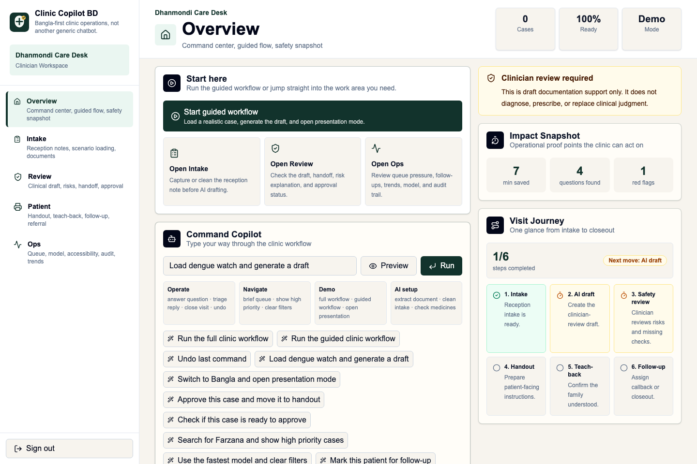
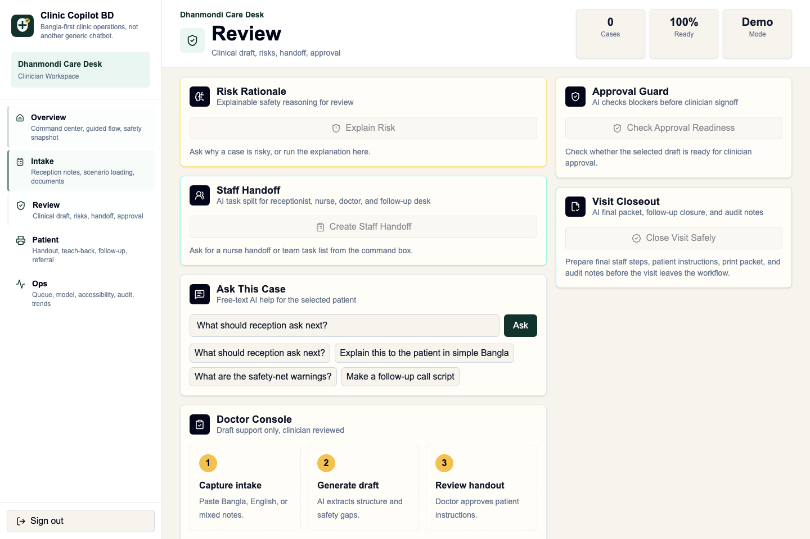
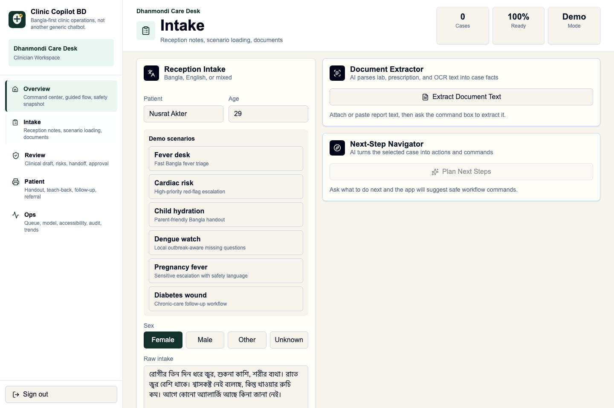
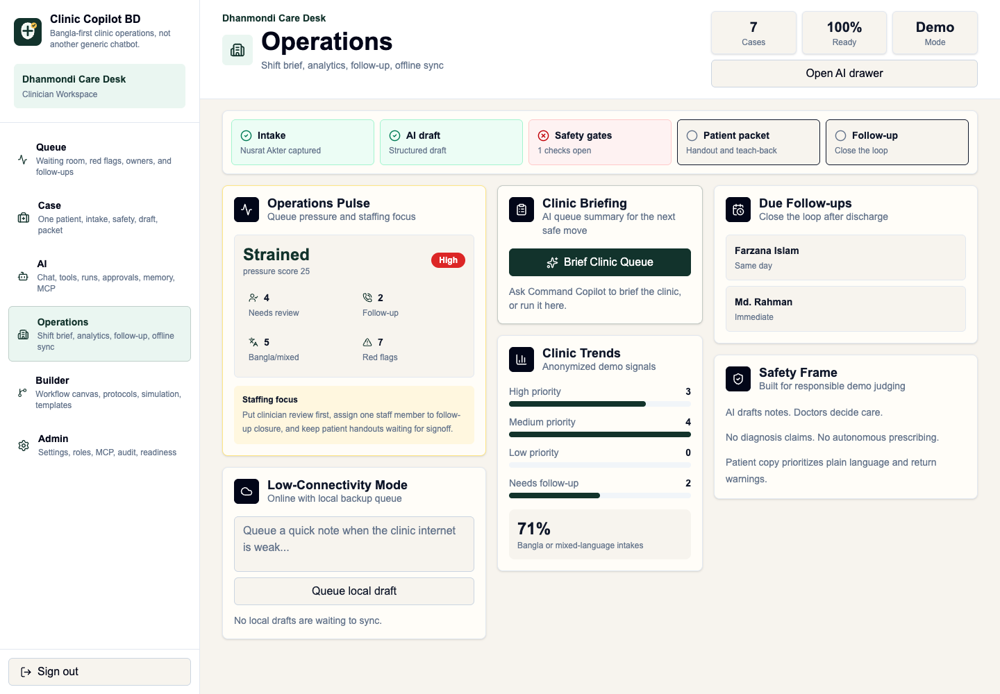
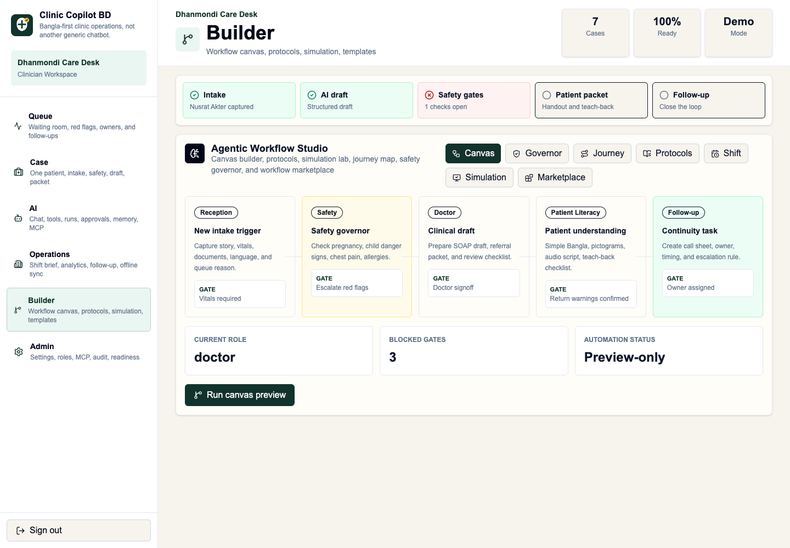
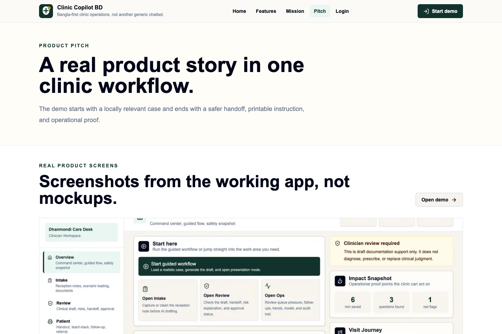

# Clinic Copilot BD

AI clinical documentation and patient communication assistant for low-resource clinics in Bangladesh.

This is a fast, bilingual clinic workflow that turns Bengali/English intake notes into structured visit summaries, doctor checklists, patient-friendly discharge instructions, and follow-up tasks.

## Product Positioning

Clinic Copilot BD is not a diagnosis or prescription engine. It is a clinical workflow copilot that helps trained clinicians document visits faster, ask better intake questions, communicate clearly with patients, and spot safety red flags.

## Core Demo

- Public landing site with feature, mission, pitch, judge, and login pages
- Interactive public homepage with MCP data-layer pitch, command preview, proof stats, feature catalog, and generated clinic visuals
- Public docs page for MCP usage, AI provenance, prompt categories, and deployment notes
- Judge Mode route at `/judge` with a clean 3-minute demo script
- Expanded pitch page with product score map, differentiators, demo runbook, and operational proof
- Generated product visuals and custom Clinic Copilot BD logo
- Model Context Protocol endpoint at `/api/mcp` for demo-safe external-agent
  tools, resources, safety gates, queue snapshots, print packets, literacy
  drafts, sync previews, approval envelopes, and scenario scorecards
- Authenticated clinic workspace with desktop sidebar and mobile bottom navigation
- Temporary email/password clinic access
- Guided demo mode with a 3-minute story rail
- Natural-language Command Copilot for operating the app by typing
- Agentic Workflow Studio with canvas-style workflow builder, safety governor,
  patient journey map, protocol library, shift copilot, simulation lab, and
  workflow template marketplace
- Agent Command Center and Agent Operating System with named tools, live tool
  streaming, agent inbox, memory, command replay, voice commands, and judge mode
- Global Ask Copilot launcher on every non-Copilot workspace
- Copilot Console with chat-first agent interface, tool calls, reasoning, receipts, approvals, memory, and MCP
- AI Run Receipts for tool inputs, output type, safety checks, status, role, and timestamp
- Approvals Inbox for vitals, allergies, red flags, patient packet print approval, and escalation acknowledgment
- MCP Explorer in Admin for inspecting schemas and running demo-safe JSON-RPC calls
- Current-case AI Q&A assistant
- Readiness scorecard for safety, accessibility, workflow coverage, and operating proof
- Clinic Display accessibility controls for large text, high contrast, and calm motion
- Reception intake in Bangla or English
- AI generated chief complaint, timeline, severity, missing questions, and red flags
- Doctor console with SOAP note, checklist, and safety framing
- Patient handout in Bangla/English with medicine schedule and return warnings
- Patient teach-back checklist to confirm family understanding before discharge
- Medicine safety clarity checker
- AI document extraction for prescription, lab, or OCR text
- AI risk explanation, staff handoff, approval guard, visit closeout, and next-step navigator
- AI referral, visit summary, patient question answer, reply triage, and follow-up scheduler
- Voice intake where browser speech recognition is available
- Realtime case board powered by Convex
- Clinic trend dashboard for anonymized severity/follow-up signals
- Operations Pulse for live queue pressure and staffing focus
- Impact snapshot for time saved, missing questions found, and red flags caught
- Visit Journey progress rail from intake through follow-up
- Clinician approval workflow and audit log viewer
- Follow-up due panel
- Full-screen presentation mode
- Responsive mobile-first interface for clinic desks and phones

## MCP Support

Clinic Copilot BD includes a demo-safe Model Context Protocol endpoint:

```txt
GET  /api/mcp
POST /api/mcp
```

The endpoint speaks JSON-RPC 2.0 over POST and supports:

- `initialize`
- `tools/list`
- `tools/call`
- `resources/list`
- `resources/read`

Available MCP tools:

- `clinic.demo_manifest` returns the public server manifest, resources, tools, and safety posture.
- `clinic.list_demo_scenarios` returns the synthetic Bangladesh-native demo scenarios.
- `clinic.workflow_brief` converts messy intake notes into draft operational support using Gemini when configured, with a demo fallback when no key is present.
- `clinic.tools.list` and `clinic.tools.describe` expose the role-aware external-agent tool registry.
- `clinic.queue.snapshot` returns red-flag lane, waiting-time, follow-up due, and owner badge signals.
- `clinic.safety.get_blockers` checks vitals, allergy status, pregnancy/child/chest-pain escalation, and return-warning confirmation.
- `clinic.print.prepare_packet` prepares draft handout, referral, medicine slip, follow-up call sheet, or doctor summary packets.
- `clinic.literacy.prepare` prepares simple Bangla, pictogram, audio script, or teach-back checklist drafts.
- `clinic.sync.preview_queue` validates low-connectivity local drafts before sync.
- `clinic.approval.request` creates a preview-only human approval request envelope.
- `clinic.demo.score_scenario` returns a synthetic judge scorecard for workflow completeness and safety.

Available MCP resources:

- `clinic://demo/scenarios`
- `clinic://demo/capabilities`
- `clinic://agents/tool-registry`
- `clinic://safety/gates`

Quick test:

```bash
curl -s http://localhost:3000/api/mcp \
  -H 'content-type: application/json' \
  -d '{"jsonrpc":"2.0","id":1,"method":"tools/list"}'

curl -s http://localhost:3000/api/mcp \
  -H 'content-type: application/json' \
  -d '{"jsonrpc":"2.0","id":2,"method":"tools/call","params":{"name":"clinic.safety.get_blockers","arguments":{"intake":"Patient has chest tightness and sweating","allergiesKnown":false}}}'
```

## Product Screenshots

### Queue workspace



### Case workspace



### Copilot workspace



### Operations workspace



### Builder/Admin workflow workspace



### Public pitch page



## Stack

- Next.js 16 App Router
- React 19
- Tailwind CSS 4
- Convex backend
- Vercel AI SDK 6
- Google Gemini provider through `@ai-sdk/google`
- JSON-RPC MCP route for agent-readable clinic context
- Biome for linting and formatting

## Environment

Convex is already configured in `.env.local`.

Add a Gemini key for live AI generation:

```bash
GOOGLE_GENERATIVE_AI_API_KEY=your_key_here
```

Optional model override:

```bash
GOOGLE_GENERATIVE_AI_MODEL=gemini-2.5-flash
```

Without an API key, the app uses a polished demo response so the UI remains fully presentable.

## Development

```bash
bun install
bun run dev
```

In a second terminal, run Convex when changing backend functions:

```bash
npx convex dev
```

Seed a product demo account:

```bash
bunx convex run seed:demo
```

Default seeded login:

```txt
doctor@demo.clinic / demo1234
```

The seed command creates six fake Bangladesh-native cases for fever, cardiac
risk, child dehydration, dengue watch, pregnancy fever, and diabetic wound
follow-up.

Public product pages:

```txt
/          Landing page and demo entry
/docs      AI, MCP, prompt, and deployment documentation
/features  Complete workflow overview
/judge     Three-minute judge walkthrough
/mission   Mission, vision, and care principles
/pitch     Product pitch
/login     Demo authentication
```

Quality checks:

```bash
bun run lint
bun run build
bun run validate
bun run qa:browser
```

`bun run qa:browser` builds the app, starts `next start`, drives the public
site and every authenticated workspace through `agent-browser`, verifies key
text and layout overflow, checks the MCP Explorer response, and saves full-page
screenshots in `artifacts/agent-browser-qa/`.

## Safety Principles

- AI output is marked as draft clinical documentation.
- The product avoids diagnosis claims.
- Clinicians remain responsible for medical decisions.
- Patient-facing output uses plain language and urgent-return warnings.
- Demo data should be fake or anonymized.

## Temporary Auth

The current prototype uses a deliberately simple email/password flow stored
in Convex. This is only for demo gating and per-user workspace separation. Replace
it with production authentication before handling real users or real patient data.

## Demo Checklist

1. Create a temporary clinic account.
2. Start in Queue, pick a case, then open the Case workspace.
3. Generate the clinical draft and review red flags.
4. Open Copilot for chat, tool runs, AI Run Receipts, Approvals Inbox, memory, and the agent timeline.
5. Open Builder and show Canvas, Safety Governor, Journey, Protocols, Shift,
   Simulation, and Marketplace tabs.
6. Copy or print the patient handout.
7. Run the medicine safety checker.
8. Move the case to handout or follow-up from the live queue.
9. Show MCP Explorer, MCP docs, Readiness card, anonymized trend dashboard, and audit log.
10. Close on the impact snapshot: minutes saved, questions found, red flags caught.

Command Copilot examples:

```txt
Load dengue watch and generate a draft
Switch to Bangla and open presentation mode
Approve this case and move it to handout
Check medicine safety for paracetamol 500mg and antibiotic twice daily
```

## Deployment Checklist

- Set `NEXT_PUBLIC_CONVEX_URL` for the deployed Convex project.
- Set `GOOGLE_GENERATIVE_AI_API_KEY` in the hosting provider and Convex env.
- Run `bunx convex deploy` for production Convex functions.
- Optionally run `bunx convex run seed:demo` before the judging session.
- Run `bun run validate` before creating the final demo build.
- Replace temporary password auth before any real-world pilot.
